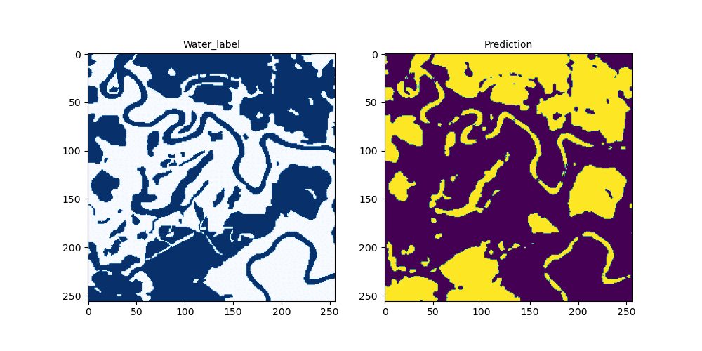

# Pytorch-UNet-Flood-Segmentation

This repository contains a PyTorch implementation of a U-Net model for segmenting water areas (flood and permanent water) in Sentinel-1 satellite images. The U-Net architecture is a popular choice for image segmentation tasks, particularly for biomedical and satellite imagery.

The model has been trained and evaluated on Cloud to Street - Microsoft flood dataset and it is composed of Sentinel-1 image chips with corresponding water labels.

<p align="center">

</p>

### Repository Structure
The repository is structured as follows:

* data/: contains datasets for model training
* models/: contains the trained U-Net models
* predictions/: contains the predictions of trained U-Net models
* runs/ : contains tensorboard log files
* make-dataset.py : the script extract and perform tiling (256*256) on Sentinel-1 VV VH and water labels chips
* gee-dem-data.py : the script to download the SRTM DEM tiles from Google Earth Engine
* gee-pwater-data.py : the script to download the JRC permanent water tiles from Google Earth Engine
* helpers.py : helper functions for gee-dem-data.py, gee-pwater-data.py and make-dataset.py
* make-features.ipynb : the jupyter notebook to arrange data before model training
* models.py : U-Net model
* model-train.ipynb : the jupyter notebook to train the models
* model-inference.ipynb : the jupyter notebook to inference the models on the test set
* requirements.txt: lists the required Python packages to run the scripts

### Preparation of data 
#### Step 1
* Download Sentinel-1 data from the Cloud to Street - Microsoft flood dataset (*c2smsfloods_v1_source_s1.tar.gz*) and Sentinel-1 water labels from the Cloud to Street - Microsoft flood dataset (*c2smsfloods_v1_labels_s1_water.tar.gz*) from https://mlhub.earth/data/c2smsfloods_v1.

#### Step 2
* Run the following scripts 
```bash
python make-dataset.py --proj_dir path/to/project-directory --chips path/to/c2smsfloods_v1_source_s1.tar.gz  --labels path/to/c2smsfloods_v1_labels_s1_water.tar.gz
```
* make-dataset.py script will create data , data/chips/VV, data/chips/VH, and data/labels directories. (The final tile size of the S1 chips is 256*256 with a resolution of 10 m)
* Below scripts will download the additional data needed for model training. (STRM DEM and JRC Permanent Water data)
* Google Earth Engine cloud project id is needed here.
```bash
python gee-dem-data.py --cld_projid ee-xxxxxxx --in_dir data/chips/VV  --out_dir data
python gee-pwater-data.py --cld_projid ee-xxxxxxx --in_dir data/chips/VV  --out_dir data
```
* gee-dem-data.py and gee-pwater-data.py scripts will create data/dem and data/pwater directories respectively.

#### Step 3
* make-features.ipynb notebook will create CSV files, which includes the file paths of S1-VV, S1-VH, DEM, JRC water, and Water labels chips for the model training.

### Model information
First, the whole dataset was divided into two parts based on the water percentage (>=30% and <30%) of the Sentinel-1 water label chips. Then two U-Net models have been trained on those two datasets and final prediction was taken by combining the predictions of both models. 

The combined prediction achieves an average Intersection over Union (IoU) of 0.877 on the test set.

#### Acknowledgments
The implementation is based on the original U-Net paper: https://arxiv.org/abs/1505.04597.

This is a basic workflow of U-Net segmentation and the models require more improvements.
